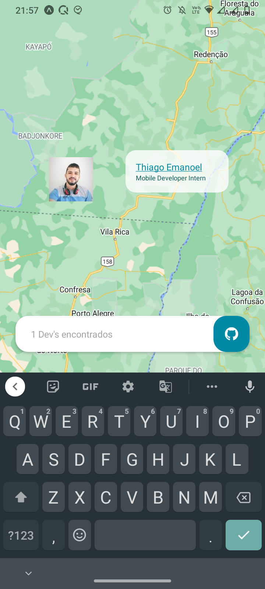
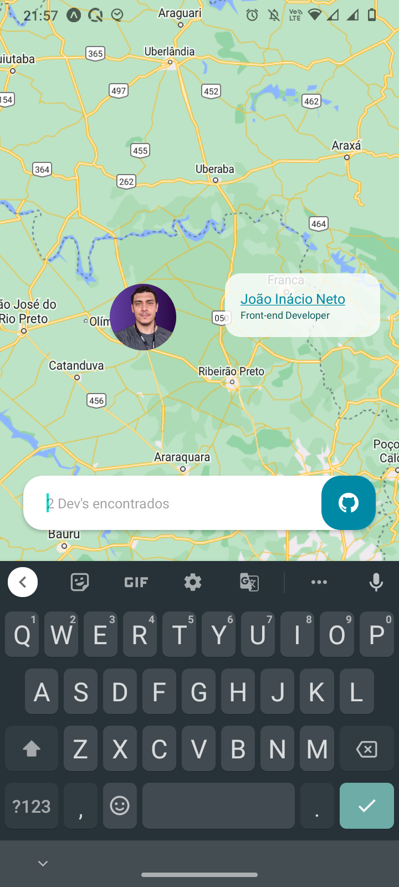
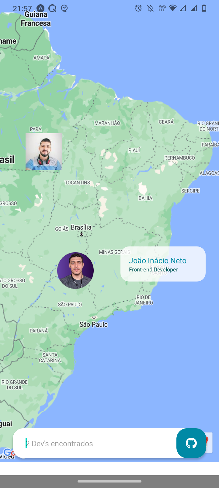

# find-devs-app

Aplicativo onde você pode descobrir a localidade no mapa de desenvolvedores que possuem uma conta no Github. O app foi desenvolvido para fins de estudo e seguindo
o [blog da Rocketseat](https://blog.rocketseat.com.br/tag/react-native/).

<br/>
<p align = "center"></p>
<br/>

<p align="center">
    
    
    </p>
<br/>
<p align="center">
    
</p>
<br/>

## :iphone: Tecnologias
- `React Native` 
- `TypeScript`
- `Expo`
- `react-native-maps`
- ...

## 💻 Instalação

Clone o projeto e acesse a sua pasta: 

```sh
$ git clone https://github.com/thiagoemanoel98/find-devs-app.git
$ cd find-devs-app
```

Instale as dependências do projeto e inicie:

```sh
# Dependências
$ expo install 

# Start App
$ expo start

```
___

Made with :coffee: by Thiago Emanoel :v:
